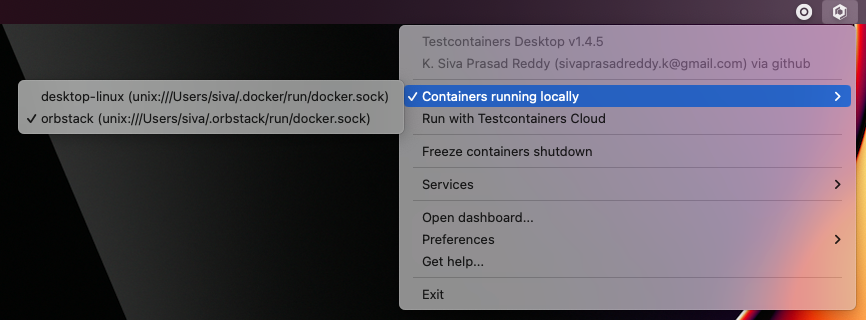
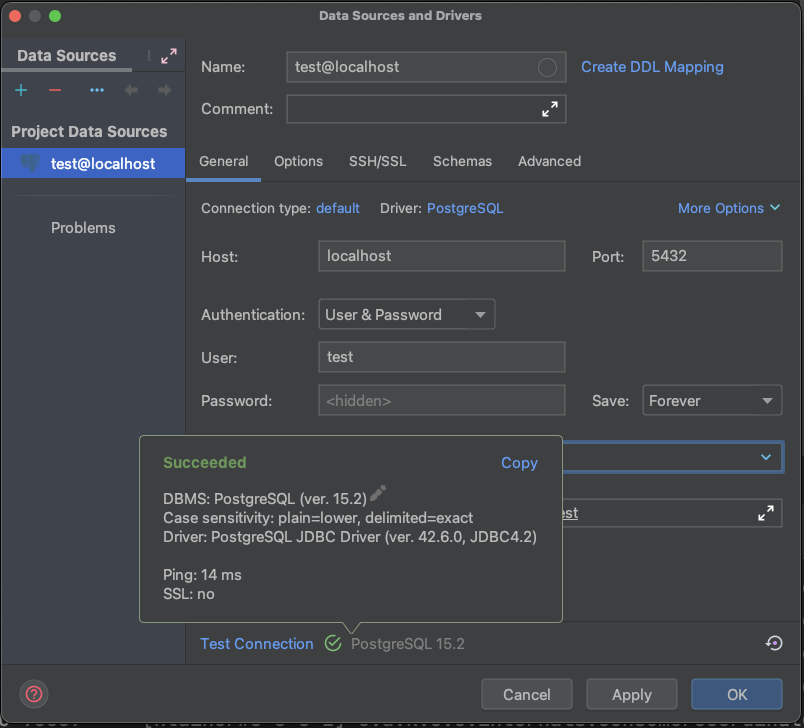
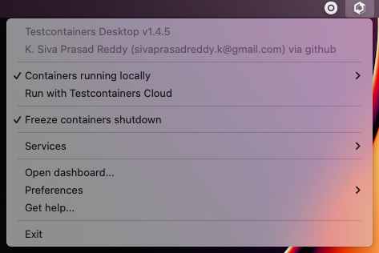
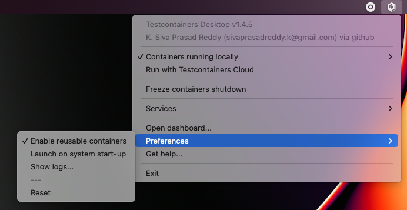

:toc:
:toclevels: 2
:codebase: https://raw.githubusercontent.com/testcontainers/tc-guide-simple-local-development-with-testcontainers-desktop/main

In this guide, you will learn how to use the Testcontainers Desktop app for local development and
explore features that help you easily debug and resolve issues.

== Prerequisites
The https://testcontainers.com/desktop/[Testcontainers Desktop] is a free companion app for open source Testcontainers libraries
that makes local development and testing with real dependencies simple. You can use the app with any Testcontainers language.
In this guide, we will explore Testcontainers Desktop features using a Java/Spring Boot application.
So, you need the following tools installed on your computer:

* Java 17+
* Your favorite IDE (Intellij IDEA, Eclipse, NetBeans, VS Code)
* A Docker environment supported by Testcontainers https://www.testcontainers.org/supported_docker_environment/

== What we are going to achieve in this guide

We will learn how to install and get started with the Testcontainers Desktop app and explore the following features:

* https://newsletter.testcontainers.com/announcements/switch-container-runtimes-and-burst-to-the-cloud[Switch container runtimes and burst to the cloud]
* https://newsletter.testcontainers.com/announcements/set-fixed-ports-to-easily-debug-development-services[Set fixed ports to easily debug development services]
* https://newsletter.testcontainers.com/announcements/freeze-containers-to-prevent-their-shutdown-while-you-debug[Freeze containers to prevent their shutdown while you debug]
* https://newsletter.testcontainers.com/announcements/enable-reusable-containers-with-a-single-click[Enable reusable containers with a single click]

== Installing Testcontainers Desktop
You can go to https://testcontainers.com/desktop/ and download your OS-specific client application and install it.
If you are using MacOS, then you can install the Testcontainers Desktop app easily using
*brew install atomicjar/tap/testcontainers-desktop* command.

== Switching container runtimes
Once the Testcontainers Desktop app is started, it will automatically detect locally installed Docker runtime(s)
and is configured to use it. You can choose which Docker runtime to use by Testcontainers libraries by selecting
from the menu options as shown below:

You can also create your free https://testcontainers.com/cloud/[Testcontainers Cloud] account and choose to save local resources
by running your containers in the cloud instead of running them on your computer.

== Using fixed ports to debug development services
While running Testcontainers-based tests, by default the container's port is mapped to a random available port
onto the host machine so that there won't be any port conflicts.

However, during development time you may want to connect to those services to inspect the data or troubleshoot surprising behavior.
It would be cumbersome to always check for which random port is assigned on the host for a container and connect to it.

The Testcontainers Desktop app makes it easy to use fixed ports for the container services so that you can always connect to
those services using the same configured fixed port.

For example, in our Spring Boot application we are using PostgreSQL database. You can start the application by running
*TestApplication.java* from your IDE. We have leveraged https://www.atomicjar.com/2023/05/spring-boot-3-1-0-testcontainers-for-testing-and-local-development/[Spring Boot's support for Testcontainers]
to automatically start the required services (in our case PostgreSQL).

We can use Testcontainers Desktop fixed port support to connect to the PostgreSQL database running as a Docker container.

Click on *Testcontainers Desktop* -> select *Services* -> *Open config location*.

In the opened directory there would be a *postgres.toml.example* file.
Rename it to *postgres.toml* file, and it should contain the following configuration:

[source,toml]
----
ports = [
    {local-port = 5432, container-port = 5432},
]
selector.image-names = ["postgres"]
----

We can configure the image selector by listing all the supported Docker image name(s).
You can configure any PostgreSQL compatible images. We are mapping the PostgreSQL container's port 5432 onto the host's port 5432.

Assume we have defined our PostgreSQL containers as follows:

[source,java]
----
@Bean
@ServiceConnection
PostgreSQLContainer<?> postgresContainer() {
   return new PostgreSQLContainer<>("postgres:16-alpine");
}
----

Now you should be able to connect to the PostgreSQL database using any SQL client with the following connection properties:

[source,shell]
----
$ psql -h localhost -p 5432 -U test -d test
----

Here is an example of connecting to the database from IntelliJ IDEA Ultimate Database Tools:

The ability to use fixed ports and connect to those services is immensely helpful during the development time.

You can also configure to run additional tools that can help you to connect to the services.
For example, you can run a Kafka container and also run a control-center that you can use to connect the Kafka instance.
Then you can use the Control Center Web UI to connect to the Kafka instance.
You can find the *Kafka* and *Control Center* configuration in *ContainersConfig.java*.

== Freezing containers to prevent their shutdown to debug
While running your tests, you may want to inspect data to debug some issue before the container is removed.
You can now use the *freeze containers shutdown* feature that will prevent the container shutdown allowing you to debug the issue.

Let's say we have the following Spring Data JPA Repository Test.

[source,java]
----
@DataJpaTest(properties = {
   "spring.test.database.replace=none",
})
@Testcontainers
class ProductRepositoryTest {

   @Container
   @ServiceConnection
   static PostgreSQLContainer<?> postgres =
                      new  PostgreSQLContainer<>("postgres:16-alpine");

   @Autowired
   ProductRepository repository;

   @Test
   void shouldCreateProductIfNotExist() {
       String code = UUID.randomUUID().toString();
       Product product = new Product(null, code, "test product", BigDecimal.TEN);
       repository.upsert(product);
   }
}
----

Let's open the Testcontainers Desktop app and enable *Freeze containers shutdown*.

After enabling "Freeze containers shutdown", run the *ProductRepositoryTest* from your IDE, and the app will prevent its shutdown,
effectively keeping the test running indefinitely. Once you're done with your investigation, uncheck the "freeze" button
to resume normal test execution, including clean-up.

While you don't need to debug via a fixed port, both features are particularly useful in combination to easily connect
a debugging tool and have time to use it. Freezing containers works with either your local runtime or Testcontainers Cloud.

Please note that the freeze containers feature is in beta and currently only supports containers with a managed lifecycle
(e.g. *@Container* annotation, inside a *try-with-resources* block, etc.).
In particular, the feature is not yet designed to freeze long-lived containers
(e.g. https://java.testcontainers.org/test_framework_integration/manual_lifecycle_control/#singleton-containers[singleton pattern]
and https://java.testcontainers.org/features/reuse/[reusable containers]).

== Enable reusable containers to speed up the development
During the development, you will keep changing the code and verify the behavior either by running the tests or running
the application locally. Recreating the containers for every code change might slow down your quick feedback cycle.
One technique that you can apply to speed up testing and local development is using
the https://java.testcontainers.org/features/reuse/[reusable containers] experimental feature.

Since you are using the https://testcontainers.com/desktop/[Testcontainers Desktop],
the *testcontainers.reuse.enable* flag is set automatically for your dev environment.
You can enable or disable it by clicking on *Enable reusable containers* option under *Preferences*.

When the reuse feature is enabled, you only need to configure which containers should be reused using the Testcontainers API.
While using Testcontainers for Java you can achieve this using *.withReuse(true)* as follows:

[source,java]
----
PostgreSQLContainer<?> postgresContainer() {
   return new PostgreSQLContainer<>("postgres:16-alpine")
           .withReuse(true);
}
----

When you spin up a container with reuse, a hash is calculated based on the container's configuration.
When you request another container with the same configuration which yields the same hash value, then the existing container
will be reused instead of creating a new container.

While using SQL databases, Testcontainers provides a special JDBC URL support to simplify the container configuration.
You can enable reuse while using special JDBC URL by appending *TC_REUSABLE=true* parameter as follows:

[source,java]
----
@DataJpaTest
@TestPropertySource(properties = {
  "spring.test.database.replace=none",
  "spring.datasource.url=jdbc:tc:postgresql:16-alpine:///db?TC_REUSABLE=true"
})
class ProductRepositoryTest {

   @Test
   void test() {
      ...
   }
}
----

Now if you run the test and then execute *docker ps* command, you can see the postgres container still running.
If you run the same test or any other test using a Postgres container with the same specification then the existing container
will be reused.

Please note that, as an experimental capability, the implementation of reusable containers currently differs across
Testcontainers libraries.
See the https://newsletter.testcontainers.com/announcements/enable-reusable-containers-with-a-single-click[release notes] for the main limitations.

== Summary
Testcontainers libraries help you test your application with real dependencies while speeding up and
simplifying local development. Various features of the Testcontainers Desktop app greatly simplify running and
debugging your application right from your IDE.

Download the https://testcontainers.com/desktop/[Testcontainers Desktop] and start your development leveraging
Testcontainers libraries of your favorite programming language.
To learn more about Testcontainers visit https://testcontainers.com/ .

== Further Reading
* https://testcontainers.com/getting-started/
* https://testcontainers.com/guides/testing-spring-boot-rest-api-using-testcontainers/
* https://testcontainers.com/guides/testcontainers-container-lifecycle/
